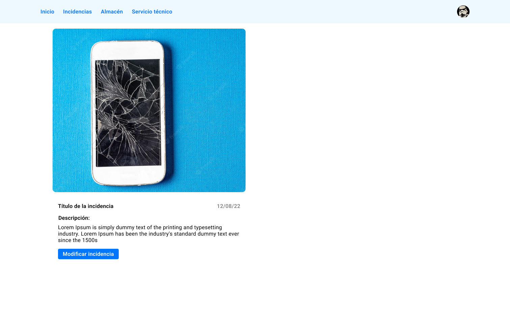

## Prueba de Maquetación Front.

El objetivo de esta prueba es conocer las habilidades y aptitudes del candidato/a que por voluntad propia desee hacerla.
Metodologías y estructuración recomendada para la prueba:

- 1. BEM
- 2. SCSS
- 3. Variables scss
- 4. Mixins y functions
- 5. Componentización del proyecto
- 6. Interacción JavaScript u otros

# Descripción

La prueba consiste en maquetar y desarrollar los estilos de una landing sencilla.
Esta consta de dos fases, la primera "estado inicial" donde tenemos una imagen con una incidencia y un botón "Modificar incidencia", en la segunda fase "estado modificando" se habilita o muestra un formulario cuando el botón "modificar incidencia" es pulsado.

La interacción no es obligatoria hacerla, pero se recomienda.
Cualquier añadido que se quiera aportar es bienvenido.

# Recursos

- Colores:
- Primary: #0076FF
- Secondary: #EEF9FF
- White: #FFFFFF
- Grey: #D9D9D9
- Fuente:
- Roboto (se adjunta en archivos)

# Apariencia

